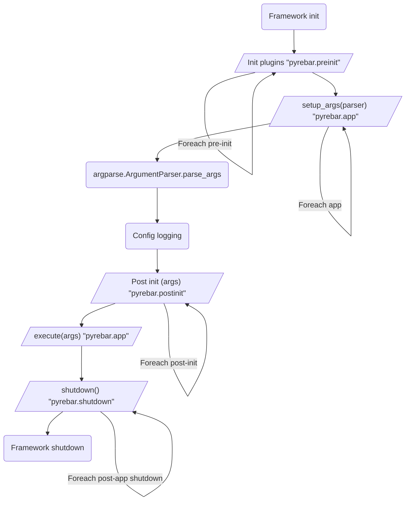

# py-rebar

Another python console application skeleton.

## Installing

```bash
pip install py-rebar
```

## Framework workflow

The py-rebar application scaffold provides for a series of plugin points for business logic to be added.



## EntryPoints

Py-rebar provides several plugin points to add the business logic to this framework.  This is done through python's [entrypoint plugin architecture](https://setuptools.pypa.io/en/latest/userguide/entry_point.html#entry-points-for-plugins). A boostrap mechanism is available for scripts being run directly, rather than relying on installed modules.

Each of the entrypoint groups listed here is defined by as `{prefix}.{group}`. These groups are defined assuming the default prefix of `pyrebar`. Applications can override the default prefix by calling `pyrebar.application.main` with a prefix.

### pre_init

Application initializers can be added an entrypoint with the `{prefix}.pre_init` group. These entrypoints must be a function that takes an optional `parser=` keyword argument. The provided parser is the root command line parser.

It is important to note that all installed `pre_init` entrypoint functions will be called prior to continuing. Any exceptions raised will cause the application to terminate.

### post_init

Application initializers added to the `{prefix}.post_init` group will be called after the command line is parsed and logging is configured, but before the main application is execution. These entrypoints must be a function that takes an optional `args=` parameter. The provided value will be an `argparse.Namespace` object holding the output of `argparse.ArgumentParser.parse_args()` function.

It is important to note that all installed `pre_init` entrypoint functions will be called prior to continuing. Any exceptions raised will trigger shutdown processing and cause the application to terminate.

### app

Application entrypoints added to the `{prefix}.app` must point to a python module. These modules contain one or more of the following specially-named variables and functions described below.

If multiple applications are found, they are registered as subcommands using the `EntryPoint.name` property.

Variables (all are optional):

* `SUBCOMMAND: str` - If multiple apps are found, this overrides the `EntryPoint.name` as the subcommand name.
* `ALIASES: list[str]` - If multiple apps are found, this list provides the set of command aliases.
* `LOGGER_NAME: str` - The application logger name. If not specified, the module name is used.

Functions:

* `config_args(parser:argparse.ArgumentParser)` - *[optional]* If specified, this function is called with the command line argument parser. If only one application is found, this will be the base parser. If multiple applications are found, this will be the subparser.
* `execute(args:argparse.Namespace=None) -> int` - The main application execution function. Called with the parsed command line arguments. The return value is passed to a `sys.exit()` call and thus is passed back to the OS.

### shutdown

Application shutdown hooks can be added to the `{prefix}.shutdown` group.  These entrypoints must point to a function that will be called without arguments. 

These shutdown hooks are called before the application exits. Note that these hooks will be called even when an exception is raised out of the `pre_init` or `post_init` hooks.  Any shutdown hook closing resources opened during an init phase must therefore handle the case the opening failed or was never called.

## Bootstrapping

For applications run directly, rather than built + installed, there are 2 options for bootstrapping:

1. Configure the entrypoints in `pyproject.toml` as described by the [setuptools documentation](https://setuptools.pypa.io/en/latest/userguide/entry_point.html). Then, call `pyrebar.bootstrap_from_pyproject('path/to/pyproject.toml')`.
2. Additional `EntryPoint` instances can be explictly added in a `__main__.py` using the `pyrebar.Plugins.add_entrypoint()` method.

## Examples

See the examples in the `src/apps` directory.